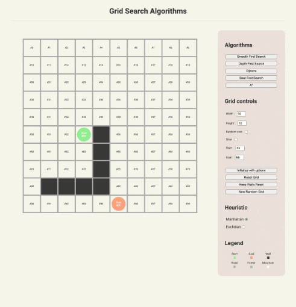

# Javascript Graph Search



* Implemented algorithms : BFS, DFS, Dijkstra, Best first, A*
* Object Oriented for graph representation :
    * Nodes, Graph, Grid (inherited from Graph), Grid in DOM (inherited from Grid)
* Asynchrone functional programming for search algorithms
* Events management with dispatch and listeners
* [Modular](https://developer.mozilla.org/en-US/docs/Web/JavaScript/Guide/Modules) Vanilla Javascript
* DOM and NodeJs versions

## How to use with NodeJs

* Make sure [Node.js](https://nodejs.org/) is installed on your system
* Open the main folder in a terminal and run :

```
node terminal.mjs
```

### Command line arguments

```
--stats
```
displays statistics about search algorithms runs

```
--path
```
draw found path in the terminal

```
--time <time>
```
set the time to wait between every algorithm call

```
--algo <algorithm>
```
choose a specific algorithm to run. Possible values are : `bfs`, `dfs`, `dijkstra`, `bestfirst`, `astar`

#### Usage example 

1 run with all algorithms on a 10x10 grid :
```
node terminal.mjs --stats
```

Display statistics and path, for 10 runs with a random grid size for every run, and a waiting time of 1000ms between each algorithm run :
```
node terminal.mjs --stats --path --runs 10 --random --time 1000
```

## How to use with a browser

Because of [CORS policy](https://developer.mozilla.org/en-US/docs/Web/HTTP/CORS), the project cannot be run by default by just opening the index.html file with a browser (with the file:// protocol).

You have to use a web server or launch the browser with file access.

Use [VSCode](https://code.visualstudio.com/) and [Live preview](https://marketplace.visualstudio.com/items?itemName=ms-vscode.live-server) extension

#### How to use the VSCode debugger and Chrome

* Close all Chrome instances
* Start the Live preview server in VSCode
* Start Chrome with the following command line :

```
Windows : chrome.exe --remote-debugging-port=9222
Linux : google-chrome --remote-debugging-port=9222
MacOS : /Applications/Google\ Chrome.app/Contents/MacOS/Google\ Chrome --remote-debugging-port=9222 &
```

* Start the debugger in VSCode
* Open the browser with the Live preview URL
* The debugger will now stop at breakpoints in the VSCode editor
